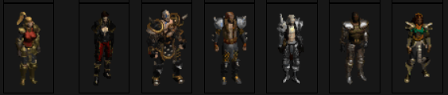
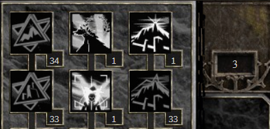

# CHARACTERS
  
All the Chars in MXL are completely different than classic Diablo II. Their skills are different, their ability to carry loot is different, etc

For the intent of letting you experience the game by yourself, and in order to not bury you under too much information, we will not spoon feed you every single aspect of the different chars. You will have to discover them by yourself. Each chars have different builds that can be played and are viable. Some builds are more viable and/or noob friendly than others, and your best bet is to look into [The Guide Center](https://forum.median-xl.com/viewforum.php?f=40) to make up your mind about them.

That said if you insist, you can go to the 'What class to play' section of the [Newbie guide](https://forum.median-xl.com/viewtopic.php?f=40&t=34407)

# SKILLS
  
Skills are the meat of your build. Most work like in Diablo II with some notable changes. One key info is to read carefully the skill description. It will help you understand them.  

Skills are explained in the Docs, under the 'Character' tab.  
- [Here](https://docs.median-xl.com/doc/class/amazon) is the amazon class with its skills explained.  
By clicking on the tab you can get to all 7 classes. 

Each level up give you a skill point to invest. You can reset your skill points 3 times ( one by difficulty level) after the first Act1 quest ( Akarat reset). In later game, an item similar to the token of Absolution drops, and is able to do the same. They are called 'Belladonna'. Keep them.

# RESISTANCES AND DEFENCE

In MXLS resistances are way more important than in Classic Diablo II. You should try to max out your resistances at all times. Here are the resistance penalties :  
- Normal = no res penalties  
- Nightmare = -30% resistance  
- Hell = -70 resistance  

At all point your max resistance is soft capped at 75% but it can be increased up to 90%. That value is 50% for physical resistance.  
You can socket either Onyx, Bloodstone, Amber or Turquoise to increase both your resistance but also your max resistance threshold.

Defence dictate the ability of your char to not get hit. Try getting as much defence as possible alongside: Avoid%, Evade% and phsysical resistance.   
The player can run, but running decrease your defense to 0 (zero). Try to not run around mobs.  

# MISCELLANEOUS

Hoarding item (gems, jewels, random crap) is useless in the beginning of the game.

Here's a list of item you should try to keep early on:  
1. Resistance gems (Onyx/Bloodstone/Amber/Turquoise)  
2. A couple of  random runes (For reroll purposes)  
3. A couple jewel for recipes (keep ***ALL*** jewels that drop in hell for crafting)  
4. The catalysts, belladonas, etc  

To get TU quicker (Check the [recipes](https://docs.median-xl.com/doc/items/cube) how to make any TU) you can farm Mephisto and then nihilatak since both of them drops Arcane shards.