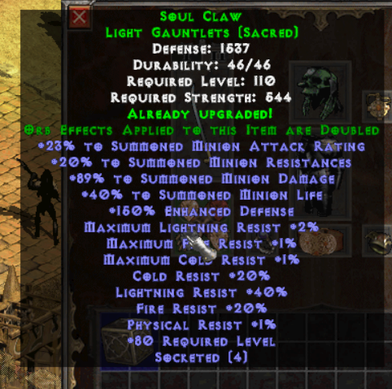
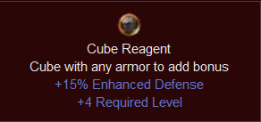

# CRAFTING

Visit [this thread](https://forum.median-xl.com/viewtopic.php?f=49&t=19419) for an in depth yet clear guide on crafting 🔨  
And this one for the [cube recipes docs](https://docs.median-xl.com/doc/items/cube).    
Items are subjected to being used in recipes, especially powerful ones, check the cube docs to know them all.

# GENERAL INFO

To understand each item types look into the first section of each item type's docs section in the [Official Documentation](https://docs.median-xl.com/). It is very clear and precise, and will help you grasp how they work.


## TU (Tiers Uniques)

TUs have 4 ranks. Their stats requirement and general power depend on their stats. Check the [docs](https://docs.median-xl.com/doc/items/tiereduniques#idx0) for a list of them all, and their stats.  
You can turn useless TU into arcane shards &rarr;  and   
  
Be careful when up-tiering a tiered unique, the requirements can jump tremendously from one tier to the other. Always check the docs out first. You cannot reduce a TU tier, only up-tiering is possible.

## SU ( Sacred Uniques)

SU are the next 'rank' of item. Generally better than T4 TU they are important for progressing in the game.
Each item types has one SU and one SSU (sacred-sacred-unique). SU on the left, SSU on the right.

A SSU isn't always better than an SU for your build. Read the documentation to check the item's stats and if they fit your build.

Sometimes a simple TU with good stats is better than an useless SU!

SU can be made into a token that add 1 (one) stat up when right clicking. Those are commonly referred as 'Sigs'. The maximum amount of sigs you can eat is 400.  
This is a sig &rarr; 

## HONORIFICS AND MYSTIC ORBS
<figure>
  
  
</figure>
Honorifics are special items that can be made with either TU or SU items. Their text appear green in the game. They can be made in the cube with ```any magic item + Mark of infusion = honorific```  
Honorifics ( like any other items) can be cubed with [Mystic Orbs (MO)](https://docs.median-xl.com/doc/items/cube#idx4) one by one to transfer the MO stat to the item, except honorific gain *double* the amount of stats and have the maximum amount of sockets. Very handy if you don't find an item you need and want to get a lot of resistance/dexterity/stats on a glove, or boots. Use a base magic item with low lvl required since *each* MO adds a + 4 level required to the item. You can only apply up to 5 of the same type of regular Mystic Orb to your item.

The mark of infusion is dropped by Shenk in act5. Honorifics can't be made before this act ( except if you transfer from another char/friend).  
MO can be brought from vendors, but they are very expensive. Around 13k each.

## MISC ABOUT ITEMS

Hoarding item (gems, jewels, random crap) is useless in the beginning of the game.

Here's a list of item you should try to keep early on:  
1. Resistance gems (Onyx/Bloodstone/Amber/Turquoise)  
1. A couple of  random runes (For reroll purposes)  
1. A couple jewel for recipes (keep ***ALL*** jewels that drop in hell for crafting)  
1. The catalysts, belladonas, etc  

To get TU quicker (Check the [recipes](https://docs.median-xl.com/doc/items/cube) how to make any TU) you can farm [Mephisto and then Nihlatak](https://forum.median-xl.com/viewtopic.php?f=49&t=18822) since both of them drops Arcane shards.

Uber charms have some randomization when it come to the amount of stats they have. Sometime you'll need to farm the charms to get a better roll.


## TIPS

1. Some maps have a drop bias towards specific types of items (check the doc).
1. The best way to drop gems is K3K.
1. Clear speed is better than MF in many cases. It's better to clear a lower level zone fast than struggle in an higher lvl one