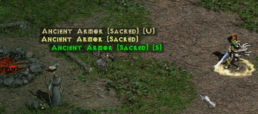
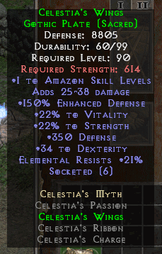

Only a couple of external tools are allowed to be used or discussed. Check this [tool page](https://www.median-xl.com/tools.php) for an official list of them all. Any other tools will get you banned.

## D2STATS AND LOOT FILTER

D2stats is a stat reader ***AND*** a loot filter. Here is the [thread](https://forum.median-xl.com/viewtopic.php?f=4&t=3702) about it  
The loot filter is customizable and will allow you to see only the item you choose to see, and also be notified when some elite item drops ( colored text in the upper left corner)  
The loot filter is included ( but can be modified)  
***Allowed online***

## SPEED CALCULATOR

This tool enables you to calculate all your character's speed breakpoints. Useful for min-maxing a char

## OFFLINE TOOLS

Median XL Offline Tools adds a nice way to manipulate character save files. It enables users to respec, rename, convert and downlevel characters. Also allows viewing, searching and mass disenchanting items, as well as sorting stash. [Support thread](http://forum.median-xl.com/viewtopic.php?f=40&t=342)  
***Singleplayer only***  

## MAP REVEAL

Map reveal in implemented into the game. No need to use any external software (they'll get you banned).  
You can reveal map by pressing the 'R' key. Or you can change this key binding in the in-game settings.

## LANGUAGES

The official language of the game is English. That said there is a translator community who made the game available in russian, french, chinese, spanish, and other languges. [Our official thread](https://forum.median-xl.com/viewtopic.php?f=4&t=22977&hilit=sigma+translations) list every up to date languages.

## ACCESSIBILITY

If you suffer from Color blindness, vision impairment or shitty screen colors syndrome, there is an in-game setting that allow to mark rare/unique/sets with an added text marker.  

Additionally, if like me, the in-game font isn't very readable you can swap for another ready made font. The installation process is less straight forward but not very complex. [Here is my guide](https://gitlab.com/Wasps/diablo-2-fonts/-/blob/master/installing.md) and personal page to get all the different font we've made
<figure>
  
  
</figure>

Feel free to check the other [tools](https://www.median-xl.com/tools.php)